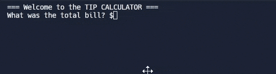

# Day 2 - Understanding Data Types and How to Manipulate Strings

## Concepts Taught

-   Python Primitive Data Types
-   Type Error, Type Checking and Type Conversion
-   Data Types
-   Mathematical Operations in Python
-   Number Manipulation and F Strings in Python

## Tip Calculator

https://replit.com/@rvitality/day-2#main.py
