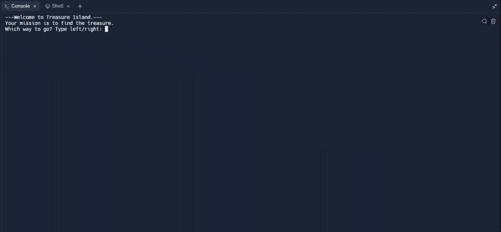

# Day 3 - Control Flow and Logical Operators

## Concepts

-   Control Flow with if / else and Conditional Operators
-   Modulo Operator
-   Nested if statements and elif statements
-   Multiple If Statements in Succession
-   Logical Operators

## Treasure Island

https://replit.com/@rvitality/day-3-start#main.py
