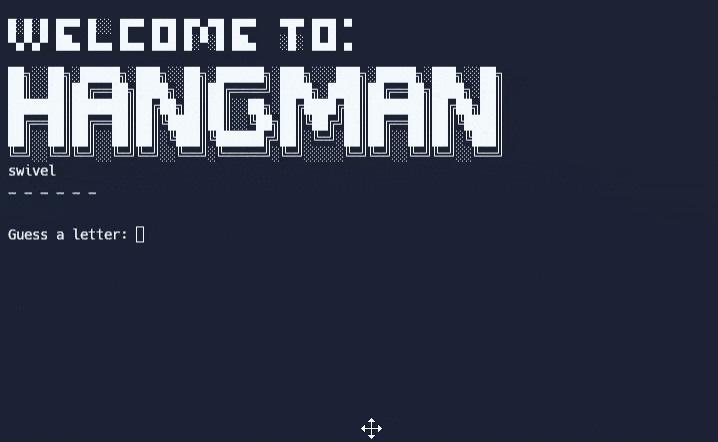

# Day 7 - Hangman

## Concepts

-   How to break a Complex Problem down into a Flow Chart
-   How to Check the User's Answer
-   Improving the User Experience
-   How to Add ASCII Art and Improve the UI

## Hangman

https://replit.com/@rvitality/hangman-game#hangman_words.py
