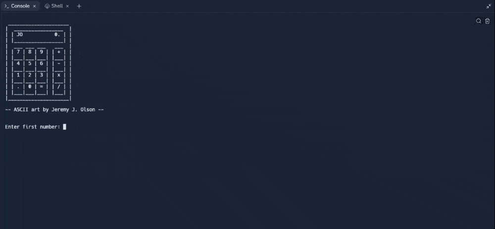

# Day 10 - Functions with Outputs

## Concepts

-   Function with Outputs
-   Multiple return values
-   Docstrings
-   Combining Dictionaries and Functions
-   Print vs. Return
-   While Loops, Flags and Recursion

## Calculator

https://replit.com/@rvitality/calculator#main.py
