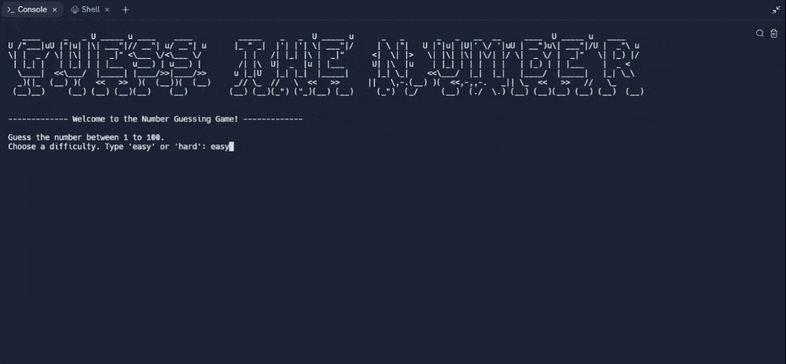

# Day 12 - Scope & Number Guessing Game

## Concepts

-   Namespaces - Local vs Global Scope
-   How to Modify a Global Variable
-   Python Constants

## The Number Guessing Game

https://replit.com/@rvitality/guess-the-number#main.py
