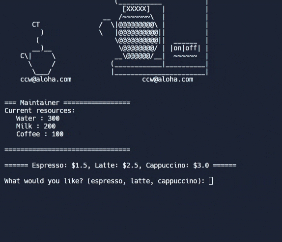

# Day 15 - Local Development Environment Setup & the Coffee Machine

## Concepts

-   Installing Python Locally
-   Setting up dev environment
-   Build a digital coin-operated coffee machine

## Coffee Machine

https://replit.com/@rvitality/coffee-machine#main.py
