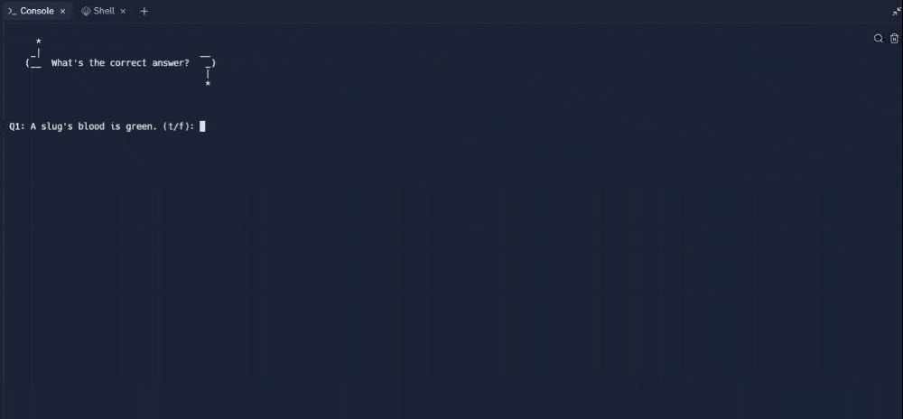

# Day 17 - The Quiz Project & The Benefits of OOP

## Concepts

-   How to create a Class in Python
-   Working with Attributes, Class Constructors and the **init** function
-   Adding Methods to a Class
-   Why OOP is better than Procedural Programming

## Quiz Project

https://replit.com/@rvitality/quiz-game-start#main.py
