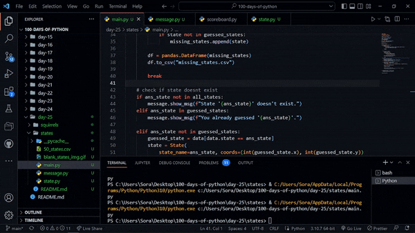

# Day 25 - Working with CSV Data and the Pandas Library

## Concepts

-   Reading CSV Data in Python
-   DataFrames & Series
-   Working with Rows & Columns
-   Data Analysis with Pandas

## U.S. States Game

