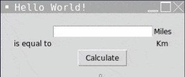

# Day 27 - Tkinter, \*args, \*\*kwargs and Creating GUI Programs

## Concepts

-   Creating Windows and Labels with Tkinter
-   Setting Default Values for Optional Arguments inside a Function Header
-   \*args
-   \*\*kwargs
-   Buttons, Entry, and Setting Component Options
-   Other Tkinter Widgets: Radiobuttons, Scales, Checkbuttons and more
-   Tkinter Layout Managers: pack(), place() and grid()

## Miles to KM Converter

https://replit.com/@rvitality/tkinter-widget-demo#main.py
