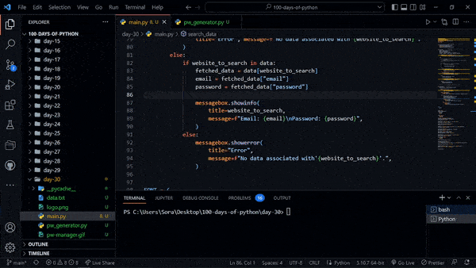

# Day 30 - Errors, Exceptions and JSON Data: Improving the Password Manager

## Concepts

-   Catching Exceptions: The try catch except finally Pattern
-   Raising Exceptions
-   IndexError Handling
-   KeyError Handling
-   Write, read and update JSON data in the Password Manager

## Password Manager 2.0

